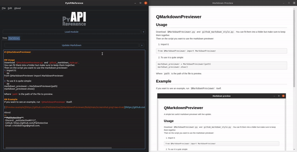

# QMarkdownPreviewer
A simple but useful markdown previewer with live update.

## Usage
Download `QMarkdownPreviewer.py` and `github_markdown_style.py`.
You can fit them into a folder but make sure to keep them together.  
Then on the script you want to use the markdown previewer:
1. Import it:
```py
from QMarkdownPreviewer import MarkdownPreviewer
```
2. To use it is quite simple:
```py
markdown_previewer = MarkdownPreviewer(path)
markdown_previewer.show()
```
Where `path` is the path of the file to preview.

## Example
If you want to see an example, run `QMarkdownPreviewer` itself.

[](https://github.com/Patitotective/QMarkdownPreviewer)

## Another implementation
**PyAPIReference** uses a similar code of this markdown highlighter to do this.
[](https://patitotective.github.io/PyAPIReference/)  
_See https://github.com/Patitotective/PyAPIReference/blob/main/PyAPIReference/GUI/markdown_previewer.py_

About
---
**Patitotective**:
- Discord: _patitotective#0127_.
- Github: https://github.com/Patitotective
- Email: cristobalriaga@gmail.com.
