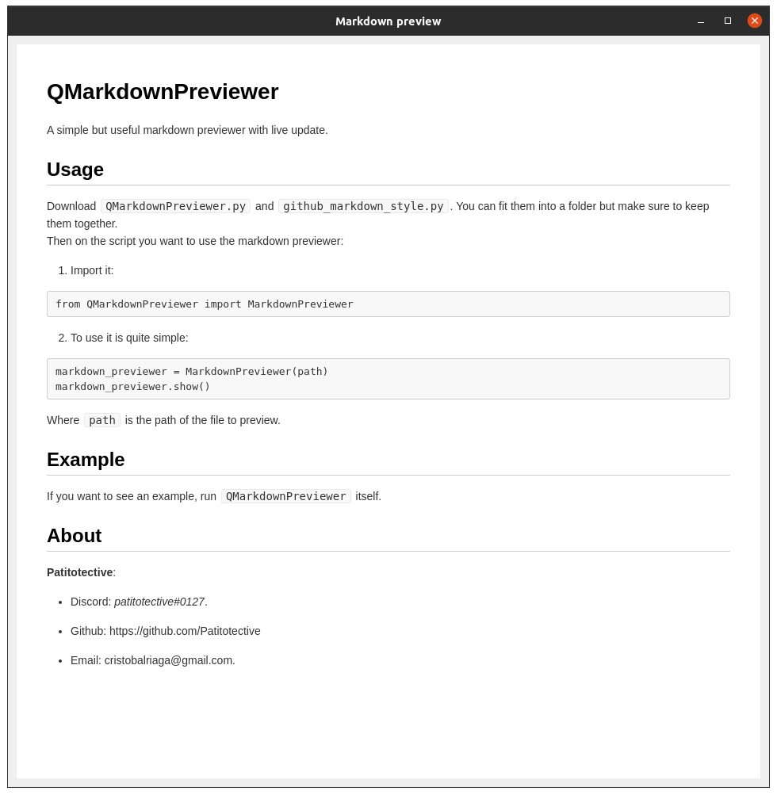

PreView
===


Overview
---

Supports **bold**, *italic* and ***bold-italic***!
Inline `code` is possible, too!

Images can be inserted using drag and drop or the corresponding MD syntax.

```
#include<stdio.h>
int main() {
    printf("Hello world!\n");
}
```

> A famous quote!
> Multiline!

* Unordered
* foo

1. Ordered
2. bar

###### I am a tiny header!

Types of links: <https://github.com/> [GitHub](https://github.com/)

CLI usage
---

`$ pymarkview -i "input.md" -o "output.html"`

show image
---
